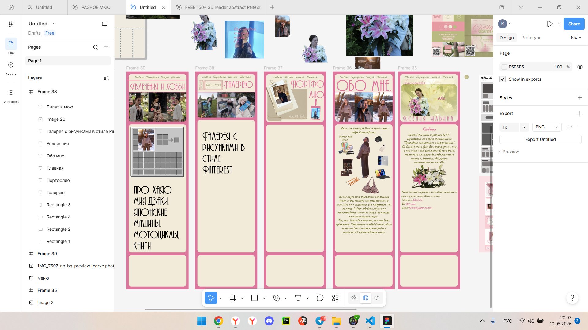

# Сайт обо мне

Добро пожаловать в репозиторий моего персонального сайта-портфолио! Это пространство, где технические навыки программирования встречаются с любовью к искусству.

## О проекте

Этот сайт — моя "цифровая визитка". Он объединяет учебные достижения в технической сфере, проекты по программированию, дизайн и художественную галерею.

### Ключевые разделы:
- **Главная:** Краткое знакомство и контакты.
- **Обо мне:** Интерактивный "Starter Pack" с использованием CSS-анимаций и кастомных Tooltips.
- **Портфолио:** Архив технических работ и учебных проектов.
- **Галерея:** Визуальное пространство с моими художественными работами в стиле Pinterest.
- **Увлечения:** Раздел, раскрывающий интересы через интерактивные элементы.

## Технологический стек

- **HTML5:** Семантическая верстка.
- **CSS3:** - Сложные анимации (`@keyframes`, `transition`).
    - Псевдоэлементы `::before` / `::after` для декоративных полос.
    - Адаптивная верстка (Flexbox, Grid, Media Queries).
- **JavaScript (Vanilla JS):** - Интерактивная логика переключения подсказок.
    - Динамическое управление DOM-элементами.
- **Дизайн:** Авторская концепция в палитре Soft Pink & Beige. Предварительно разработан в Figma.
  

## Как запустить

1. Склонируйте репозиторий:
   ```bash
   git clone [https://github.com/ваш-никнейм/название-репозитория.git](https://miss-pink-elf.github.io/Internet-technologies/)

   
